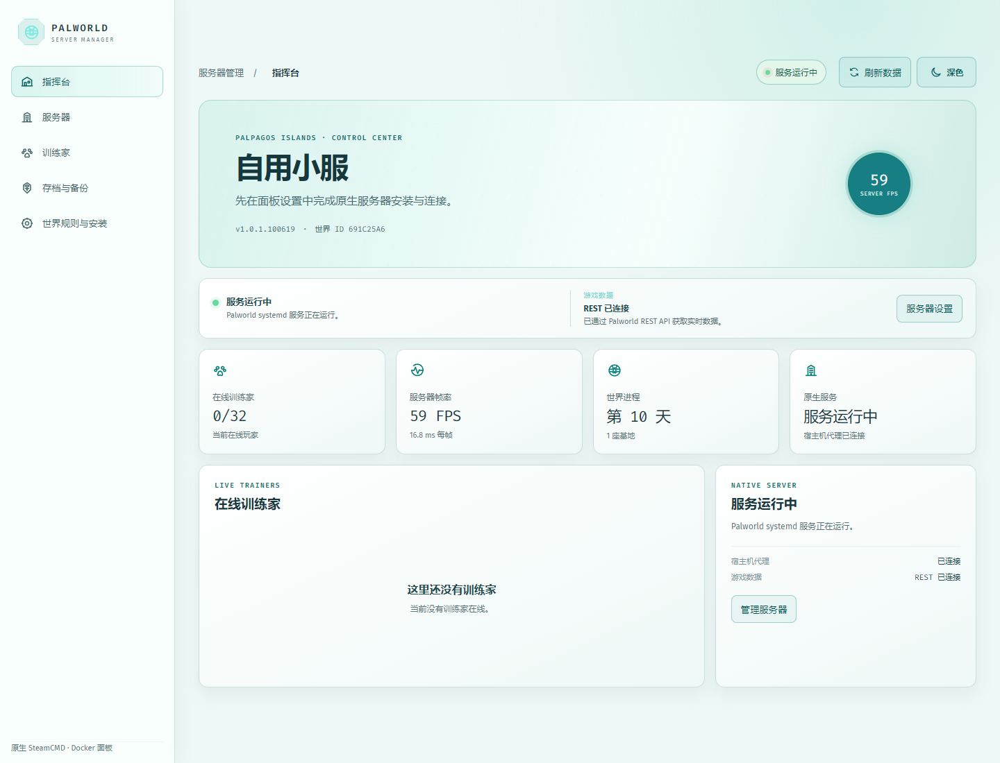
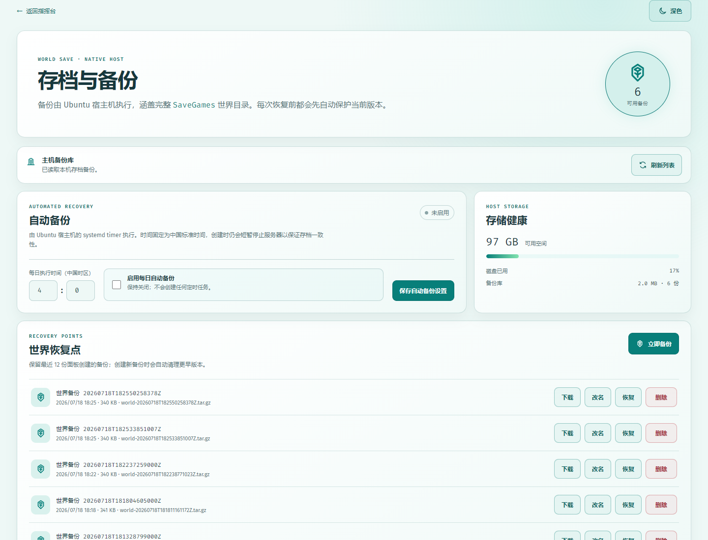
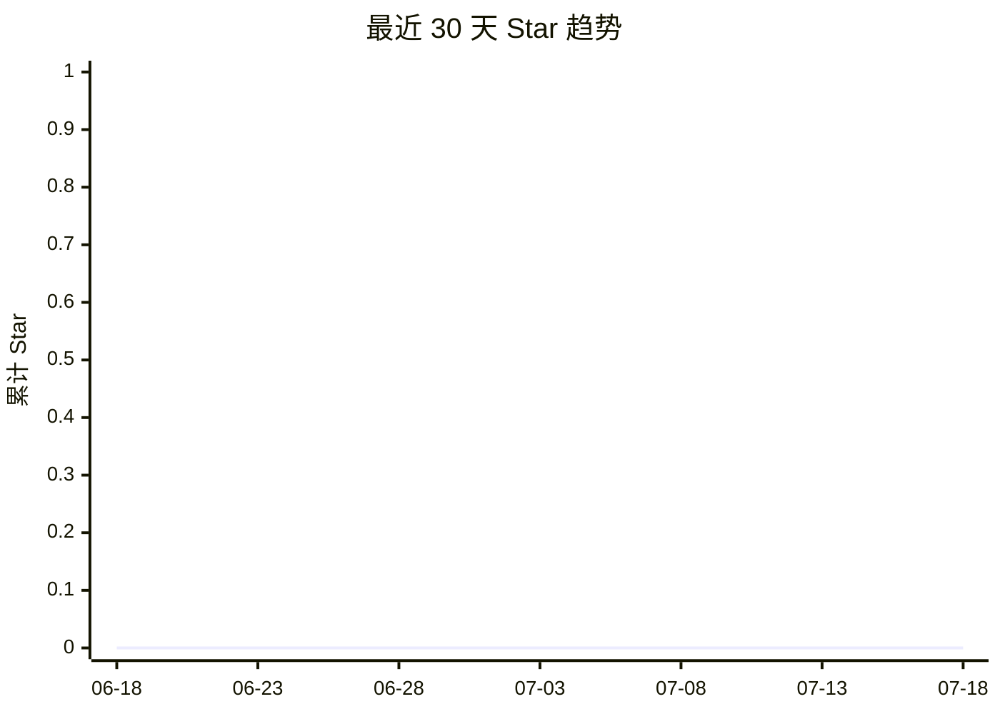

# Palworld Server Manager

用于管理 Ubuntu 原生 Palworld Dedicated Server 的 Docker 面板。

Docker 只运行面板；SteamCMD、游戏服务器和 systemd 服务都留在 Ubuntu 宿主机上。面板通过受限代理执行固定的运维操作。



## 功能

- 从零安装 SteamCMD、Palworld Dedicated Server 与原生 systemd 服务。
- 在面板中更新、启动、停止、重启服务器；任务过程保存在独立的运行日志页。
- 读取官方 REST API：服务器版本、FPS、在线训练家、世界天数与基地数量。
- 主页显示宿主机 CPU、内存、磁盘与 Palworld 进程；保留 FPS、人数和资源趋势。
- 分类编辑完整世界规则；未知的新配置项会保留，写入前自动备份 INI。
- 创建、下载、重命名、删除与恢复完整世界存档；恢复前自动保护当前存档。
- 每日自动备份（默认关闭，使用中国时区）以及备份库/磁盘容量监测。
- 深色与浅色主题，适合长时间运维查看。



## 架构与边界

```text
浏览器
  │ HTTP :8080（可改为 :18080）
  ▼
Docker：manager（Nginx + React + FastAPI）
  │ Unix Socket
  ▼
Ubuntu：受限 host-agent（仅允许固定运维动作）
  ├─ SteamCMD：/opt/steamcmd
  ├─ Palworld：/opt/palserver
  ├─ systemd：palworld-server.service
  └─ 备份：Compose 同级 ./backups/
```

`host-agent` 不提供任意 Shell 执行能力，只接受安装、更新、服务控制、配置读写和备份等固定动作。所有安装路径限制在 `/opt` 下。

## 系统要求

- Ubuntu 22.04/24.04 或兼容的 systemd Linux 宿主机。
- Docker Engine 与 Docker Compose Plugin。
- 建议至少 4 核 CPU、16 GB 内存和 40 GB 以上可用磁盘空间。
- 对外开放游戏 UDP 端口（默认 `8211/udp`）；管理面板仅建议通过反向代理或受限的 TCP 端口访问。

> 不要将 Palworld REST API 端口（默认 `8212`）直接暴露到公网。

## 首次部署

### 1. 下载 Compose 并启动面板

```bash
mkdir -p ~/palworld-server-manager
cd ~/palworld-server-manager

# 直接获取最新 Compose 文件
curl -fsSLO https://raw.githubusercontent.com/ChrisShen-github/PalWorldServerManager/main/compose.yaml

docker compose pull
docker compose up -d
docker compose ps
```

默认访问地址为 `http://<服务器 IP>:8080`。如需改为 `18080`，编辑 `compose.yaml` 中的端口映射，将 `8080:80` 改成 `18080:80` 后再启动。

首次启动只会拉取管理面板镜像，不会下载游戏服务器。

### 2. 仅首次安装宿主机代理

容器启动后会把代理初始化到 Compose 同级的 `./host-agent/`。在 Ubuntu 宿主机执行一次：

```bash
sudo ./host-agent/install.sh
```

确认代理正常：

```bash
systemctl status palworld-host-agent.service
```

以后无需手动复制或 Git 拉取代理文件。重建面板容器时，最新 Agent 会自动同步，systemd 会加载新版本。

### 3. 在面板中安装并配置游戏服务器

1. 打开 **世界规则与安装**。
2. 保留或调整安装目录：SteamCMD 为 `/opt/steamcmd`，服务器为 `/opt/palserver`。
3. 点击 **安装 SteamCMD 与服务器**，等待完整日志完成。
4. 设置服务器名称、管理员密码、玩家人数与世界规则后保存。
5. 点击 **启动**。

首次保存配置时，面板会从 `DefaultPalWorldSettings.ini` 初始化 `OptionSettings`；后续写入前会保留一份带时间戳的 `.bak` 配置备份。

## 日常使用

### 指挥台

首页聚合两类实时信息：

- **宿主机状态**：Agent 连通性、systemd 服务状态。
- **游戏状态**：Palworld REST API 的版本、FPS、玩家数、在线训练家与世界信息。

若页面显示 REST 未连接，进入 **世界规则与安装** 保存管理员密码与 REST 端口。保存配置会自动启用 `RESTAPIEnabled=True`；重启服务器后生效。

### 更新服务器

在服务器管理区点击 **更新服务器**。更新流程会停止原生服务、通过 SteamCMD 校验 App `2394010`，然后重新启动服务。建议在更新前先创建一个手动备份。

### 存档与恢复

备份包含完整的 `SaveGames` 目录，保存在 Compose YAML 同级的 `./backups/`：

```text
backups/
├─ world-20260718T182550258378Z.tar.gz
└─ metadata.json
```

- **立即备份**：短暂停服、打包存档、自动重启服务。
- **导入存档**：上传 `.tar.gz` 备份包。归档必须以 `SaveGames/` 为根目录；面板会拒绝路径穿越、软链接、异常文件数量或过大的解压内容，导入后可像普通恢复点一样下载、改名和恢复。
- **下载**：下载对应 `.tar.gz` 归档。
- **恢复**：两步确认后执行；恢复前先自动备份当前世界，随后替换存档并重启服务。
- **保留策略**：面板创建或导入的最新 12 份备份会保留，更早的会自动清理。

备份显示名与归档标识都按中国标准时间生成，例如 `世界备份 20260718T182550258378Z`。

### 每日自动备份与存储健康

在 **存档与备份** 页设置小时、分钟并勾选 **启用每日自动备份**，再保存。时间始终按 `Asia/Shanghai` 解释，即使 Ubuntu 使用 UTC 也会在正确的中国时间执行。

默认状态为关闭：没有勾选并保存前，不会创建或启用 `palworld-backup.timer`。页面同时显示：

- 当前备份库体积与备份数量。
- 备份目录所在磁盘的剩余空间与已用比例。
- 自动计划是否真正启用。

### 运行日志

**运行日志** 页会保留最近 120 条安装、更新、服务启停、手动/自动备份、存档导入和存档恢复的过程记录。日志文件位于 Compose 同级的 `./logs/operations.json`，不会记录面板中的 REST 管理密码。

### 运行监控

指挥台每 20 秒刷新一次时会采样宿主机 CPU、内存、磁盘、Palworld 进程、游戏 FPS 与在线人数，并保存最近 720 个样本。趋势数据保存在面板的 `./data/` 中；只有打开指挥台或手动刷新时才会产生新样本，不会额外常驻一个采集进程。

## 更新管理面板

在 Compose 目录执行：

```bash
docker compose pull
docker compose up -d --force-recreate
docker compose ps
```

面板数据保存在 `./data/`，备份保存在 `./backups/`；更新容器不会删除它们。更新后可用下面命令检查健康状态：

```bash
curl -fsS http://127.0.0.1:8080/api/health
```

## 本地开发（不使用 Docker）

Windows PowerShell 中打开两个终端：

```powershell
# 终端 1：项目根目录
.\.venv\Scripts\python.exe -m uvicorn backend.app.main:app --reload --port 8010
```

```powershell
# 终端 2：项目根目录
cd frontend
npm install
npm run dev
```

打开 Vite 输出的地址（通常是 `http://localhost:5173`）。开发环境会将 `/api` 转发至 `http://localhost:8010`。

## 最近 Star 趋势

数据来源为 [GitHub 公开仓库接口](https://api.github.com/repos/ChrisShen-github/PalWorldServerManager)，统计截至 **2026-07-18**：当前 **0 Star / 0 Fork**，最近 30 天没有新增 Star 事件。



## 参考

- [Palworld 官方服务器文档](https://docs.palworldgame.com/)
- [Bluefissure/pal-conf](https://github.com/Bluefissure/pal-conf)
- [cheahjs/palworld-save-tools](https://github.com/cheahjs/palworld-save-tools)
